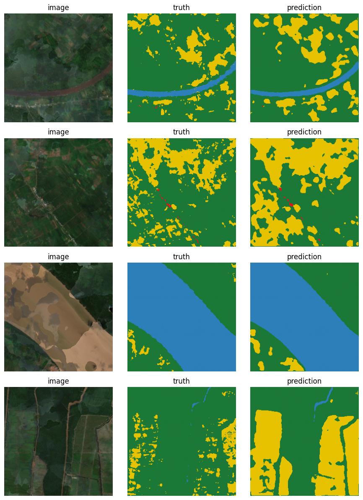
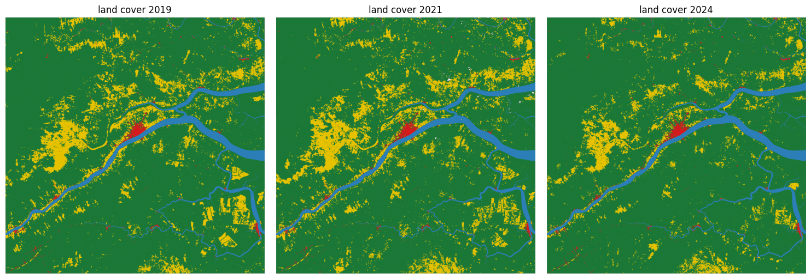
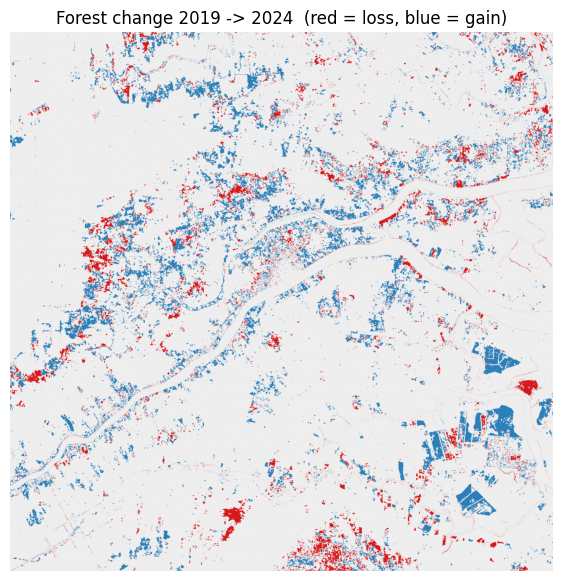
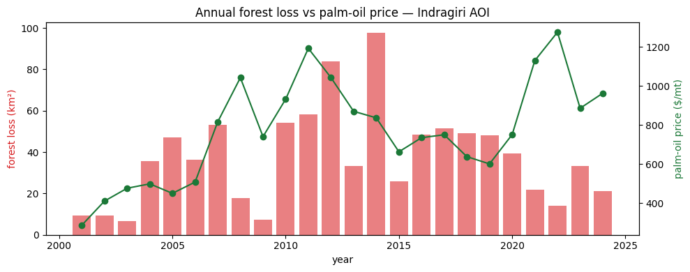

# Land Cover Change Detection: Riau, Sumatra

## Why this project

The lowland forests of Riau, Sumatra have been among the fastest-disappearing
on Earth, cleared largely for oil-palm plantations. This project asks two
questions with open data:

1. **Can a segmentation model trained on raw Sentinel-2 imagery map land cover
   accurately enough to track change over time?**
2. **Does the palm-oil commodity price help explain the *rate* of forest loss,
   and is there a lag?**

It combines satellite remote sensing, deep-learning computer vision, and a bit
of environmental economics.

## What it does

- Pulls **cloud-masked Sentinel-2** surface-reflectance composites (free, ESA
  Copernicus via Google Earth Engine) for a Riau deforestation front, one per
  year for **2019 / 2021 / 2024**.
- Trains a **U-Net** to segment 4 land-cover classes: forest, agriculture,
  urban, and water, using **ESA WorldCover (10m)** as the label source. (A 5th
  class, bare ground, was dropped as it's ~0.02% of this coastal AOI.)
- Runs inference across all three years and **quantifies per-class change**.
- Cross-checks forest loss against **Hansen Global Forest Change** (annual,
  2001–2023) and runs a **lagged regression** vs **World Bank palm-oil prices**.
- Outputs before/after maps, a forest-cover time series, and the economic
  correlation plot.

## Key design decisions

- **Labels from a published product.** Hand-labelling satellite pixels is
  not feasible, so the U-Net is trained to reproduce ESA WorldCover from raw S2
  bands.
- **Composites, not single scenes.** Riau is extremely cloudy, thus should median-
  composite cloud-masked imagery over the dry season (Jun–Sep) each year.
- **Two evidence streams for the economics.** The U-Net gives 3 high-detail
  snapshots (the CV showcase); Hansen GFC gives ~23 annual points so the
  price→forest-loss regression is actually meaningful.
- **"Forest" means tree cover, and the data is imbalanced on purpose.** Every
  Riau AOI reads as 85-93% forest because WorldCover labels mature oil palm as
  Tree cover. I keep the most class-diverse AOI (Indragiri coast), handle the imbalance with a weighted
  loss + per-class IoU, and measure deforestation as tree-cover *loss* over
  time. Splitting natural forest from plantation (via a dedicated oil-palm map)
  is the planned extension, not the baseline.

## Results & findings

**Segmentation (U-Net, 4-class, validation):** best **mIoU 0.716**.

| class | IoU | note |
|---|---|---|
| water | 0.93 | spectrally distinct, easiest |
| forest | 0.86 | abundant, well-learned |
| urban | 0.58 | only 0.6% of pixels; class weighting earns this |
| agriculture | 0.41 | shares a fuzzy edge with "forest" |



*Validation tiles: Sentinel-2 image, WorldCover label, U-Net prediction.*

**Change detection (2019 → 2024).** Run across the three
years, the model reports forest *increasing* (net **+110 km²**; share 83.5% →
87.1%), which looks backwards for a deforestation front. It isn't reforestation however, it's:

1. **Plantation maturation reads as "forest gain."** Mature oil palm is labelled
   Tree cover, so clear→replant→regrow nets out as a *gain* in tree cover even as
   natural forest is lost.
2. **Year-to-year noise.** The trend is non-monotonic (83.5 → 82.1 → 87.1), thus the
   fingerprint of composite/model inconsistency, not a real trajectory.

**Takeaway:** the U-Net is strong for **land-cover mapping**, but a 3-snapshot
model difference is *not* a reliable net-deforestation metric here. That is
exactly why the deforestation statistics come from **Hansen** (annual, 2001–2023,
which flags loss *events*) rather than from differencing model snapshots.





**Economics (Hansen forest loss vs palm-oil price, 2001–2024):** A lagged OLS
finds only a **weak, non-significant** link, best at a **3-year lag (R² = 0.13,
p = 0.11)**, with a positive slope at every lag. The direction is suggestive
(higher price → later clearing), but with only ~23 yearly points, a *global* price
against a *single* ~3,000 km² AOI, and big confounders (the 2011 moratorium, the
2015 fires, COVID), **price alone doesn't explain local forest loss.** Thus, I reported
as an honest near-null result.



## Methods

1. **Imagery**: Sentinel-2 L2A surface reflectance (6 bands: B2/3/4/8/11/12),
   cloud-masked with **Cloud Score+**, median-composited over the dry season
   (Jun–Sep) for each year.
2. **Labels**: ESA WorldCover 2021, remapped to 4 classes; the 2021 composite +
   labels form the single labelled training pair.
3. **Dataset**: 256×256 px tiles, **spatial** train/val split (rightmost 20%
   held out to avoid leakage), median-frequency class weights.
4. **Model**: ResNet-34 **U-Net** (`segmentation-models-pytorch`), best checkpoint by val mIoU.
5. **Change**: one trained model applied to 2019/2021/2024; per-class area +
   forest-loss map.
6. **Economics**: Hansen annual forest loss vs World Bank palm-oil price,
   lagged OLS regression.

## Limitations

- **"Forest" = tree cover.** WorldCover labels mature oil palm as tree cover, so
  the model can't separate plantation from natural forest. Thus, net tree-cover change
  *understates* real deforestation.
- **3-snapshot change is noisy.** Year-to-year composite/model differences swamp
  real conversion, so model-snapshot differencing is unreliable for net change
  (hence Hansen for the loss statistics).
- **The economic test is weak by design.** ~23 yearly points, a *global* price
  against one ~3,000 km² AOI, autocorrelation, and confounders (2011 moratorium,
  2015 fires, COVID) → association at best, not causation.
- **Single AOI, single label epoch.** Trained on 2021 labels over one box;
  generalisation elsewhere is untested.

## Future work

- **Split natural forest from plantation (the key extension).** Fuse a dedicated
  oil-palm map (e.g. Descals et al. 2021 global oil palm, 10 m) so "tree cover"
  separates into **natural forest vs plantation**. This directly fixes the
  headline limitation and turns net tree-cover change into a true
  natural-forest-loss signal.
- **More snapshots / a temporal model** to suppress year-to-year noise.
- **Larger and multiple AOIs**, plus a second label epoch, for honest cross-year
  validation.
- **Uncertainty estimates** on per-class IoU and change (e.g. bootstrap over
  tiles).

## Stack

Python ; Google Earth Engine ; PyTorch (`segmentation-models-pytorch`) ;
rasterio / GeoPandas ; statsmodels ; Colab (GPU training)

## Project structure

```
landcover-change/
├── configs/            # study area, years, class scheme, GEE collection ids
├── notebooks/          # the pipeline, 01–07 (Colab)
├── outputs/figures/    # result figures embedded in this README
├── docs/               # setup / GEE registration notes
└── src/landcover/      # (reserved) home for a reusable-module refactor
```
